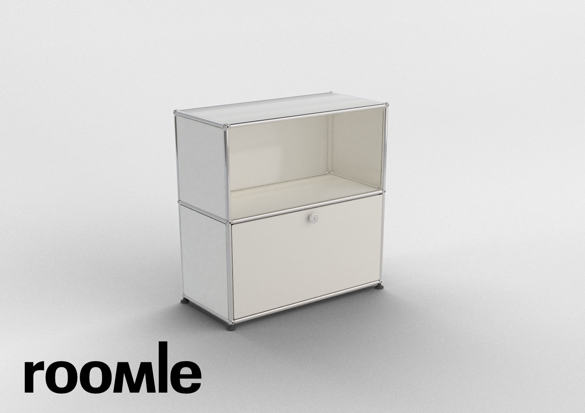
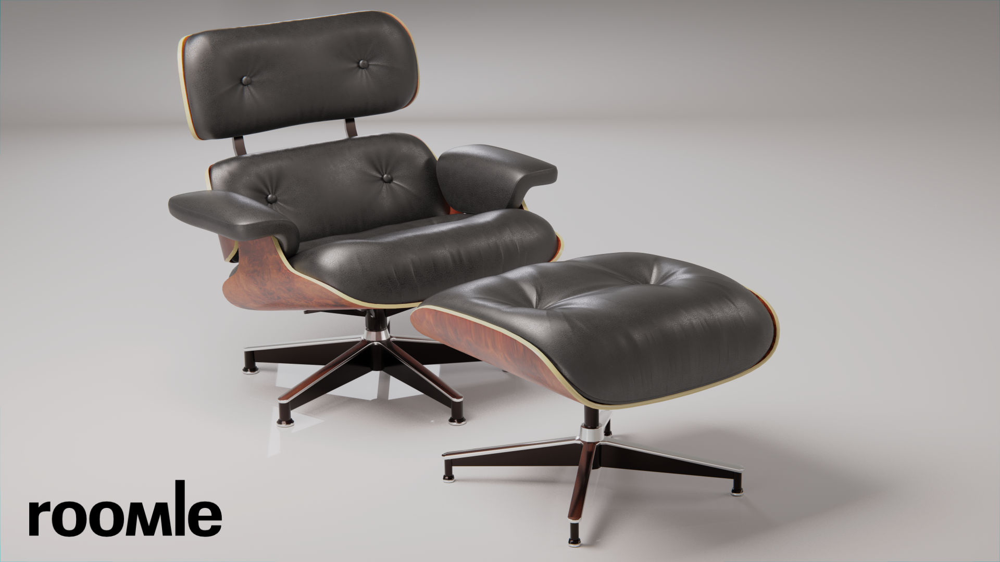

# threejs-playground
A three.js boilerplate scene with a couple of demo furniture objects. Use it as a starting point to tweak rendering and lighting.

## Build and run
* Make sure you have node.js and npm installed ( https://nodejs.org )
* Check-out the repository
* Open a terminal and navigate to the project's folder
* Run `npm install`
* Run `npm run dev` to spawn a local webserver for development. You should now be able to open the scene in your browser with this URL: `http://localhost:8080`

# What to do
Clone this repository and make the rendering visually stunning and as photo realistic as possible.

Feel liberated when it comes to using/choices of:
* Lighting / Lights
* Skybox/Environment map
* Rendering technique (forward, deferred, HDR, linear lighting, ... )
* Effects ( tone mapping, color grading, ambient occlusion, reflections, shadows, bloom, depth of field ... )

## Dos
* Use the provided scene / models
* Use three.js (any version)
* Use physically based shading/rendering/materials, based on the Disney principled shader (metallic roughness) or similar
* Avoid rendering artifacts like aliasing as good as possible
* Support low-end hardware (like mobiles of reasonable age of 1-2 years )
* May use WebGL 2.0, but with WebGL 1.0 fallback support
* Keep a steady framerate of ~30 fps, especially when (camera) movement happens

## Don'ts
* Pre-process/alter the provided models/materials. Use them as they are (but feel free to give feedback).
* Pre-bake lighting / lightmaps / shadows
* Change the surrounding/environment to something completely different. It has to be a bright, almost white background.

## Secondary goals
* Quick startup/loading time

## Nice to haves
* Switch quality levels when the camera stops moving (like Sketchfab does, for example)
* Scale up the quality on more powerful clients (desktop)
* Easy on battery/ hardware resources

# Submit / Get in contact
Feel free to show your results publicly via forked repository / pull request or host it somewhere. If you don't want to disclose your code or assets, feel free to obfuscate it or simply share a screencast.
Send results to graphics@roomle.com
We're looking forward to it!

# References

